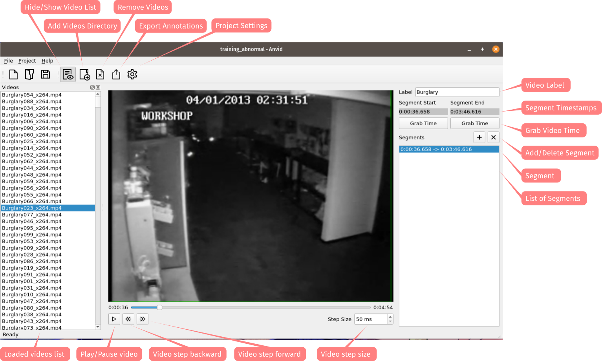

.. raw:: html

    

      <h1>Anvid</h1>
    

|Python Version| |Contributions Welcome| |License|

.. |Python Version| image:: https://img.shields.io/badge/python-v3.7+-blue.svg
   :target: http://shields.io/
.. |Contributions Welcome| image:: https://img.shields.io/badge/contributions-welcome-orange.svg
   :target: http://shields.io/
.. |License| image:: https://img.shields.io/badge/license-MIT-blue.svg
   :target: https://opensource.org/licenses/MIT

A PyQt5-based GUI application to make temporal annotations on videos for training machine learning models.

Installation
============

Before you are ready to run Anvid, ensure you have `Python 3.7` or later on your system as well the latest pip version. We recommend to run Anvid within a python virtual environment for easier management. If you don't have a virtual environment already created, create a new one by issuing the following commands within a directory of your choice:

.. code-block:: bash

    python3 -m venv pyenv
    source pyenv/bin/activate

Within the directory where you wish to install Anvid, download the latest source code using git:

.. code-block:: bash

    git clone git://github.com/raikel/mcrops.git

Or download it manually. After that, cd into the project directory and install python dependencies:

.. code-block:: bash

    cd anvid
    pip install requirements.txt
    
Start the application by typing:

.. code-block:: bash

    python anvid/app.py

Usage
=====

